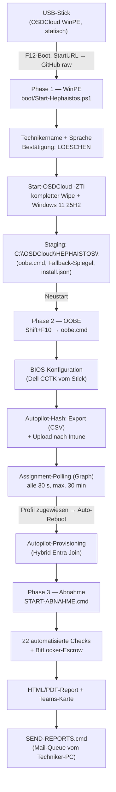

# HEPHAISTOS — Gesamtdokumentation

**SLG Notebook-Onboarding der nächsten Generation** · Version 1.0.2 · Stand: August 2026

> HEPHAISTOS (der Schmiedegott, Erbauer von Automaten) schmiedet aus roher
> Dell-Hardware fertige Flottengeräte: kompletter Disk-Wipe, Neuaufbau nach
> Vorlage, Autopilot-Anbindung, automatisierte Abnahme — und sämtliche Scripts
> kommen zur Laufzeit aus diesem GitHub-Repository. Der USB-Stick ist nur noch
> der Hammer.

**Inhalt**

1. [Executive Summary](#1-executive-summary)
2. [Systemüberblick & Architektur](#2-systemüberblick--architektur)
3. [Einrichtung (einmalig)](#3-einrichtung-einmalig)
4. [Bedienung pro Gerät](#4-bedienung-pro-gerät)
5. [Funktionsweise im Detail](#5-funktionsweise-im-detail)
6. [Konfigurations-Referenz](#6-konfigurations-referenz)
7. [Troubleshooting](#7-troubleshooting)
8. [Sicherheitskonzept](#8-sicherheitskonzept)
9. [Roadmap & offene Punkte](#9-roadmap--offene-punkte)
10. [Anhang](#10-anhang)

---

## 1. Executive Summary

**Ausgangslage.** Das bisherige Notebook-Onboarding (USB_ScriptTool Rev03–Rev05)
lief vollständig vom USB-Stick. Das funktionierte, hatte aber einen strukturellen
Schwachpunkt: Jeder Stick trug seine eigene Script-Kopie. Fixes und Verbesserungen
mussten auf jeden Stick einzeln verteilt werden — in der Praxis entstand
**Versions-Drift**: kein Stick war wie der andere, Fehlerbilder waren nicht
reproduzierbar, und niemand wusste sicher, welcher Stand wo lief.

**Lösung.** HEPHAISTOS dreht das Modell um: Der Stick enthält nur noch eine
statische, wartungsfreie Boot-Umgebung (OSDCloud WinPE). **Alle Logik wird zur
Laufzeit aus einem zentralen GitHub-Repository geladen** — bei jedem einzelnen
Gerätedurchlauf die jeweils aktuelle Version. Ein Bugfix wird einmal gepusht und
ist ab diesem Moment auf jedem Stick weltweit wirksam, ohne dass ein Stick
angefasst wird.

**Kernergebnisse:**

| Eigenschaft | Vorher (Rev05) | HEPHAISTOS |
|---|---|---|
| Script-Verteilung | manuell pro Stick | zentral, ein `git push` |
| Versions-Drift | strukturell unvermeidbar | ausgeschlossen (Versions-Banner + eine Quelle) |
| Windows-Installation | manuell im Setup-Assistenten | vollautomatisch (OSDCloud ZTI, Windows 11 25H2) |
| Autopilot-Zuweisung | „warten und hoffen" | aktives Graph-Polling + automatischer Neustart |
| Abnahme-Checks | fest verdrahtet | 22 Checks, einzeln per Config schaltbar |
| Secrets | teils im Klartext im Script | ausschließlich AES-256-verschlüsselt auf dem Stick |
| Offline-Fähigkeit | gegeben (alles lokal) | erhalten: automatischer Fallback auf Stick-Spiegel |
| Nachvollziehbarkeit | keine | Git-Historie + CHANGELOG + unveränderliche Release-Tags |

**Sicherheitsprinzip:** Das Repository ist öffentlich (technische Voraussetzung
für den unauthentifizierten Boot-Abruf) und deshalb per Policy **wissensfrei**:
keine Tenant-Daten, keine Secrets, keine Gerätedaten. Alles Sensible liegt
AES-256-verschlüsselt (PBKDF2-SHA256, 600 000 Iterationen) ausschließlich auf dem
Stick und wird nur mit der Team-Passphrase nutzbar. Details: Kapitel 8.

---

## 2. Systemüberblick & Architektur

### 2.1 Die drei Phasen



Für Textumgebungen dieselbe Kette als ASCII:

```text
Stick (WinPE) ──F12──▶ Phase 1: Dialog → Wipe + 25H2 → Staging → Reboot
                        Phase 2: OOBE (Shift+F10) → BIOS → Hash → Polling → Auto-Reboot
                                 └──▶ Autopilot-Provisioning (Hybrid Join)
                        Phase 3: Abnahme → Report (HTML/PDF/Teams) → Mail-Queue
```

### 2.2 Design-Prinzipien

1. **Eine Quelle der Wahrheit.** Scripts, Konfiguration und Dokumentation leben
   im Repo. Der Branch `main` ist Produktion; jeder Push wirkt sofort flottenweit.
2. **Jeder Netz-Abruf hat einen Offline-Fallback.** Build-USB spiegelt das Repo
   nach `_HEPHAISTOS\Fallback\` auf den Stick; die Boot-Phase spiegelt zusätzlich
   nach `C:\OSDCloud\HEPHAISTOS\Fallback\`. Fällt GitHub aus, läuft der Prozess
   mit der lokalen Kopie weiter — mit deutlicher gelber Warnung inkl. Stand-Datum.
3. **Versions-Banner überall.** Jedes Script meldet beim Start Version und
   Bezugsquelle (GitHub-URL oder lokale Kopie). Versions-Drift ist damit sichtbar,
   bevor er Schaden anrichtet.
4. **Portiert, nicht neu erfunden.** Die gesamte über Jahre erarbeitete
   Feldlogik des Rev05-Toolkits (Dell-WMI-Pfade, VC++-Runtime-Workaround,
   Event-845-Alterscheck, PRT-Kontext-Erkennung, …) wurde 1:1 übernommen.
   Jede Abweichung ist im CHANGELOG begründet.
5. **Hybrid Entra Join bleibt.** Die Flotte ist Hybrid-joined; die Abnahme prüft
   AzureAdJoined **und** DomainJoined. Nichts im System setzt Entra-only voraus.
6. **Sichtbares Feedback.** Einheitliche Farbsprache (Grün = OK, Gelb = Hinweis,
   Rot = Fehler, Cyan = Aktion, Grau = Nebeninfo), Phasen-Kopfzeilen mit
   Zeitschätzung, `Write-Progress` bei allen längeren Vorgängen.

### 2.3 Komponenten

| Komponente | Ort | Aufgabe |
|---|---|---|
| `boot/Start-Hephaistos.ps1` | Repo (StartURL-Ziel) | WinPE-Dialog, Wipe + Installation, Staging |
| `lib/Hephaistos.Common.ps1` | Repo | gemeinsame Bibliothek: State, Secrets, UI, Loader |
| `oobe/oobe.cmd` + `Invoke-HephaistosOnboarding.ps1` | gestaged auf C: / Repo | OOBE-Orchestrierung |
| `oobe/steps/*` | Repo | Einzelschritte BIOS, RemoveWinRE, AutopilotHash |
| `abnahme/Test-HephaistosDevice.ps1` + `report/*` | Repo | Abnahme-Checks + Report-Pipeline |
| `send/Send-QueuedReports.ps1` | Repo/Stick | Sammel-Mailversand am Techniker-PC |
| `config/deploy.json`, `config/report-checks.json` | Repo | zentrale Laufzeit-Konfiguration |
| `tools/Build-USB.ps1`, `tools/New-HephaistosSecrets.ps1` | Repo (lokal ausgeführt) | Stick-Bau, Secrets-Erzeugung |
| USB-Stick | physisch | Boot-Medium, Offline-Spiegel, Secrets-Blob, CCTK, Logs/State |

---

## 3. Einrichtung (einmalig)

### 3.1 Voraussetzungen

- **Admin-PC** mit Windows 11, Adminrechten und Internet.
- **Git-Clone des Repos** (nicht der ZIP-Download — nur der Clone kann per
  `git pull` aktuell gehalten werden):
  `git clone https://github.com/Himerys/HEPHAISTOS.git`
- **Windows ADK + WinPE-Add-on** (zwei separate Installer!):
  ```powershell
  winget install --id Microsoft.WindowsADK --exact --accept-source-agreements --accept-package-agreements
  winget install --id Microsoft.ADKPEAddon --exact --accept-source-agreements --accept-package-agreements
  ```
  `Build-USB.ps1` prüft beides vor dem Start (Schritt 0) und erklärt bei Fehlen
  die Downloads.
- **Entra-App-Registrierung** (bestehend): App mit Application-Permission
  `DeviceManagementServiceConfig.ReadWrite.All` (Autopilot-Import + Zuweisungs-
  Polling). Empfehlung: Secret-Laufzeit 6–12 Monate, Rotationsprozess siehe 8.4.
- **Repo public** — die StartURL und alle Laufzeit-Downloads laufen
  unauthentifiziert über `raw.githubusercontent.com`.

### 3.2 Stick bauen

In einer **Administrator-PowerShell** aus dem Clone:

```powershell
cd C:\Pfad\zum\HEPHAISTOS
git pull
.\tools\Build-USB.ps1
```

Das Script arbeitet fünf Schritte ab und meldet jeden farbig:

| Schritt | Inhalt |
|---|---|
| 0 | ADK + WinPE-Add-on vorhanden? (sonst Abbruch mit Anleitung) |
| 1 | OSD-PowerShell-Modul installieren/laden |
| 2 | 25H2-OSName gegen den OSD-Katalog verifizieren (alle Sprachen + Aktivierung) |
| 3 | OSDCloud-Template + Workspace + WinPE (Dell-/WiFi-Treiber, StartURL) + `New-OSDCloudUSB` |
| 4 | Stick-Sync: Repo-Spiegel → `_HEPHAISTOS\Fallback\`, Launcher (`START-ABNAHME.cmd`, `SEND-REPORTS.cmd`) mit eingesetzter RawBase in den Stick-Root, Ordnerstruktur |
| 5 | Abschluss-Checkliste (Handarbeit, siehe 3.3/3.4) |

Nur Stick-Inhalte auffrischen (nach einem `git pull`, ohne WinPE-Neubau):
`.\tools\Build-USB.ps1 -SkipUsbCreation`

### 3.3 Secrets-Blob erzeugen

```powershell
.\tools\New-HephaistosSecrets.ps1
```

Fragt interaktiv ab: Tenant-ID, App-ID, Client Secret, Report-Empfänger,
Teams-Webhook (optional), MailSender (optional, reserviert) sowie zweimal die
**Team-Passphrase**. Ergebnis: `HEPHAISTOS-Secrets\hephaistos.secrets.enc.json`
auf dem Stick — AES-256, PBKDF2-SHA256 mit 600 000 Iterationen. Details Kapitel 8.

### 3.4 CCTK-Paket auf den Stick

Das BIOS-Paket ist zu groß/lizenzpflichtig fürs Repo und wird manuell kopiert:

```text
<Stick>:\_HEPHAISTOS\Tools\
├── CCTK\applyconfig.bat        ← vorentpacktes SCE (bevorzugt; am Admin-PC:
│                                  Pro16Plus_CCTK_x64.exe /s /e=C:\Temp\CCTK)
├── Pro16Plus_CCTK_x64.exe      ← Original-SCE als Fallback (exakt dieser Name)
└── vc_redist.x64.exe           ← VC++-Runtime für den SCE-Fallback (exakt dieser Name)
```

Optional (Empfehlung, wie im Alt-Toolkit): interne Ordner vor Fummelei verstecken —
`attrib +h +s E:\_HEPHAISTOS` und `attrib +h +s E:\HEPHAISTOS-Secrets`
(nur die Ordner, nicht rekursiv; `Logs\` und `HWID\` bleiben sichtbar).

---

## 4. Bedienung pro Gerät

### 4.1 Phase 1 — WinPE (Wipe + Installation)

1. Stick anstecken, Gerät einschalten, **F12** → vom USB-Stick booten.
2. WinPE lädt `Start-Hephaistos.ps1` live von GitHub (Versions-Banner mit
   Quelle, Modell und Service Tag).
3. **Technikername** eingeben (Pflichtfeld; wird auf dem Stick gespeichert und
   später als Vorschlag angeboten).
4. **Sprache** wählen (`1` Deutsch = Default, `2` Français, `3` Polski).
5. **Roter Warnblock**: kompletter Disk-Wipe. Bestätigung durch Eingabe von
   `LOESCHEN`. Jede andere Eingabe bricht ab.
6. Ab hier vollautomatisch: OSDCloud löscht die Disk und installiert
   Windows 11 25H2 in der gewählten Sprache (ESD-Download, je nach Netz
   ca. 20–40 Minuten). Danach staged das Script die OOBE-Dateien und startet
   nach Countdown neu.

### 4.2 Phase 2 — OOBE (BIOS + Autopilot)

1. Nach dem Neustart in der Windows-OOBE („Region wählen"): **Shift+F10**.
2. In der Konsole starten: `C:\OSDCloud\HEPHAISTOS\oobe.cmd`
   (lädt die aktuelle Script-Version aus dem Repo, sonst lokale Kopie).
3. Der Orchestrator führt automatisch aus:
   - **BIOS-Konfiguration** (CCTK vom Stick; ca. 30–90 s),
   - optional **RemoveWinRE** (nur wenn in `deploy.json` aktiviert; mit
     Konsequenz-Warnung und Rückfrage),
   - **Autopilot-Hash**: Offline-CSV auf den Stick (immer, als Backup), dann
     GroupTag-Auswahl (`SLGDE`/`SLGFR`/`SLGPL`/`SLGTEST`), Upload nach Intune
     mit den App-Credentials aus dem Secrets-Blob (Passphrase-Eingabe).
4. **Assignment-Polling**: Das Script fragt Graph alle 30 s (max. 30 min), bis
   das Autopilot-Profil zugewiesen ist. Dann **automatischer Neustart** —
   das Gerät bootet direkt ins Autopilot-Provisioning (Hybrid Join, Apps,
   Richtlinien). Bei Timeout: gelber Hinweis (GroupTag-Gruppenzuordnung prüfen),
   kein Neustart.

### 4.3 Phase 3 — Abnahme

1. Nach abgeschlossenem Provisioning (Benutzer angemeldet): Stick anstecken,
   im Stick-Root **`START-ABNAHME.cmd`** doppelklicken (holt sich Adminrechte
   per UAC und lädt die aktuelle Script-Version).
2. Ablauf automatisch: Technikername bestätigen (Vorschlag aus Phase 1) →
   BitLocker-Escrow nach Entra ID → **22 Checks** (Kapitel 6.3) → dreistufiges
   Ergebnis **SUCCESS / SUCCESS_WITH_WARNINGS / FAILED** → HTML- und PDF-Report
   in `Logs\<ServiceTag>\` → optional Teams-Karte (Webhook aus dem Secrets-Blob).
3. **Mailversand gesammelt** vom Techniker-PC: Stick am eigenen Rechner
   anstecken, **`SEND-REPORTS.cmd`** starten. Sendet alle noch nicht
   versendeten Reports über Graph (SSO) bzw. Outlook-Fallback und markiert sie
   mit `.sent`.

---

## 5. Funktionsweise im Detail

### 5.1 Laufzeit-Delivery & Offline-Fallback

Jedes Entry-Script trägt denselben **Lib-Bootstrap**: TLS 1.2 aktivieren →
`lib/Hephaistos.Common.ps1` von GitHub nach `%TEMP%` laden → bei Fehlschlag die
erste vorhandene Fallback-Kopie (Staging auf C: bzw. `_HEPHAISTOS\Fallback` auf
dem Stick) mit gelber Warnung inkl. Stand-Datum → Dot-Source. Die Bezugsquelle
wird gemerkt und im Versions-Banner angezeigt. Dieselbe Mechanik
(`Get-HephaistosScript` / `Get-HephaistosConfig`) laden Konfiguration,
Einzelschritte und Report-Module.

Die Boot-Phase aktualisiert den Fallback-Spiegel auf C: zusätzlich Datei für
Datei frisch aus dem Repo (best effort) — das Gerät nimmt also die neueste
Version mit in die OOBE, selbst wenn dort kein Netz mehr wäre.

### 5.2 State-System

Pro Gerät führt der Stick `Logs\<ServiceTag>\state\` mit Flag-Dateien
(Namen aus dem Alt-Toolkit beibehalten):

| Flag | gesetzt von | Bedeutung |
|---|---|---|
| `step2_osinstall.started` | Boot, **unmittelbar vor** `Start-OSDCloud` | Wipe von diesem Stick initiiert |
| `step2_osinstall.done` | OOBE (automatisch) | Neuinstallation nachgewiesen |
| `step1_bios.done` | OOBE / BIOS-Schritt | CCTK erfolgreich (RC = 0) |
| `step3_hash.done` | OOBE / Hash-Schritt | Hash exportiert/hochgeladen (Detail nennt Variante + GroupTag) |
| `step4_compliance.done` | Abnahme | Abnahme bestanden (ggf. mit Hinweisen) |

Die **Schritt-2-Erkennung** ist manipulationssicher gebaut: `done` wird nur
gesetzt, wenn das Installationsdatum des laufenden Windows (Registry,
Unix-Epoch) **jünger** ist als das `started`-Flag. Ein Werks-OS fällt durch
beide Prüfungen. (Der Rev05-Bug, bei dem sich das Flag selbst bestätigte, ist
behoben — siehe CHANGELOG.)

### 5.3 Secrets-Architektur

- **Blob-Format v2**: AES-256, Schlüssel per PBKDF2 (explizit SHA-256,
  600 000 Iterationen, 16-Byte-Zufalls-Salt, Zufalls-IV). Der Blob speichert
  seine KDF-Parameter mit — künftige Härtungen brauchen keinen Formatbruch.
- **Abwärtskompatibel**: Alte Rev05-Blobs (100 000 Iterationen, SHA-1) werden
  erkannt, gelesen und **beim nächsten Entsperren automatisch auf v2
  re-verschlüsselt** (Migration ohne Techniker-Aufwand).
- **Inhalt**: Tenant-ID, App-ID, Client Secret, Report-Empfänger,
  Teams-Webhook-URL, MailSender (reserviert). Damit sind auch die früher im
  Script-Klartext gepflegten Werte (Empfänger, Webhook) in den Blob gewandert —
  eine Quelle, verschlüsselt.
- **Bedrohungsmodell**: Stick-Verlust allein kompromittiert nichts (Passphrase
  nötig); Repo ist per Policy wissensfrei; das Klartext-Secret existiert nur
  flüchtig im Arbeitsspeicher während des Uploads. Details Kapitel 8.

### 5.4 Check-Engine der Abnahme

Jeder Check läuft über `Invoke-Check -Id <kebab-case-id>`:

- **Config-Gate**: Fehlt die ID in `report-checks.json` → Check aktiv
  (sicherer Default). Steht sie auf `false` → der Testblock wird **nicht
  ausgeführt**, der Check erscheint im Report als **SKIPPED**
  („per Config deaktiviert") — sichtbar, aber ohne Einfluss auf Summary und
  Exit-Code.
- **Zwei Schweregrade**: Pflicht-Checks ergeben bei Fehlschlag FAILED
  (blockiert die Abnahme, Exit-Code 1); als `-Warning` markierte Checks ergeben
  WARN (gelb, blockiert nicht). Dreistufiges Gesamtergebnis:
  SUCCESS / SUCCESS_WITH_WARNINGS / FAILED.
- **Netskope-Sonderfall** (Praxiswissen): Meldet sich der lokale LAPS-Admin
  (`<HOSTNAME>\intuneadm`, Kontoname aus der Config) an der Konsole an, gibt es
  konstruktionsbedingt kein Steering-Profil — der Tunnel-Check prüft dann nur
  den Dienst `stAgentSvc` und besteht mit entsprechendem Hinweis, statt falsch
  rot zu werden. Die Entscheidungslogik ist als pure Funktion gekapselt und
  per Trockentest abgesichert.
- **Ausgabeformate**: Konsole (farbig) + Textreport + JSON (Schema 2, für den
  HTML-Report) — alles direkt im Geräteordner auf dem Stick.

### 5.5 Assignment-Polling (Neu in HEPHAISTOS)

Nach erfolgreichem Hash-Upload pollt das Script
`deviceManagement/windowsAutopilotDeviceIdentities` (Filter auf die
Seriennummer) alle 30 Sekunden, maximal 60-mal (30 Minuten), mit
Fortschrittsanzeige und einmaliger Token-Erneuerung bei 401. Sobald
`deploymentProfileAssignmentStatus` mit `assigned` beginnt, startet das Gerät
nach sichtbarem 10-Sekunden-Countdown automatisch neu — direkt ins
Autopilot-Provisioning. Das ersetzt das frühere „ein paar Minuten warten und
hoffen" durch einen bestätigten Zustand.

### 5.6 Report-Pipeline

1. **HTML-Report** aus dem JSON der Check-Engine: Onboarding-Schritte (aus den
   State-Flags), alle Checks mit Status-Pills, dreistufiges Badge. Corporate-
   tauglich gestaltet, druckfähig.
2. **PDF** via Edge headless (best effort; robustes Argument-Quoting auch bei
   Pfaden mit Leerzeichen).
3. **Teams-Karte** (AdaptiveCard) via Workflows-Webhook: Ampelfarbe, Gerät,
   Service Tag, Hostname, primärer Benutzer, Techniker; optional PDF-Anhang als
   Base64 für den Power-Automate-Flow (SharePoint-Upload + Link-Button).
4. **Mail-Queue**: Reports ohne `.sent`-Markierung sendet `SEND-REPORTS.cmd`
   gesammelt vom Techniker-PC — bevorzugt Graph `/me/sendMail` (SSO, keine
   Outlook-Sicherheitsabfragen), Fallback klassisches Outlook (COM).

### 5.7 Versionierung & Rollback

Eine zentrale Versionskonstante speist Banner, Report-Kopf und -Fuß (kein
Drift mehr zwischen Header und Footer). Änderungen laufen über `main`
(= Produktion); **Release-Tags** (`v1.0.2`, …) sind mit GitHubs
Release-Immutability unveränderlich und dienen als Rollback-Anker: Im Notfall
wird `Repo.RawBase` in `deploy.json` auf einen Tag gestellt und die Flotte
läuft sofort wieder auf dem letzten bekannten guten Stand.

---

## 6. Konfigurations-Referenz

### 6.1 `config/deploy.json`

| Feld | Beispielwert | Bedeutung |
|---|---|---|
| `ConfigVersion` | `2.0.0` | Schema-Version der Config |
| `OS.OSName` | `Windows 11 25H2 x64` | OSDCloud-Betriebssystem (Kurzform; Sprache/Aktivierung sind separate Parameter) |
| `OS.OSEdition` | `Pro` | Edition |
| `OS.OSActivation` | `Retail` | Aktivierungskanal |
| `Languages` | `1→de-de, 2→fr-fr, 3→pl-pl` | Auswahlmenü der Boot-Phase |
| `DefaultLanguageKey` | `1` | Default (Enter genügt) |
| `MinBuild` | `26200` | Mindest-Build für die Abnahme (eine Quelle für Build-Check) |
| `Bios.StorageMode` | `Ahci` | Ziel-Storage-Modus; wird VOR der Installation in WinPE geprüft/gesetzt (RAID→AHCI nach der Installation würde den Boot brechen). `Keep` = Preflight aus |
| `Bios.DefaultPackage` | `CCTK` | Standard-CCTK-Paketordner unter `_HEPHAISTOS\Tools\` |
| `Bios.Packages` | `"Pro 13 Plus": "CCTK-Pro13Plus", …` | Modell-Teilstring → Paketordner; automatische Erkennung am WMI-Modellnamen, längster Treffer gewinnt, fehlender Ordner fällt auf das Standard-Paket zurück |
| `Languages.<n>.GroupTag` | `SLGDE` | GroupTag-Vorschlag je Sprache (WinPE-Vorauswahl, OOBE bestätigt mit Enter) |
| `RemoveWinRE` | `false` | OOBE-Schritt WinRE entfernen (Konsequenzen beachten!) |
| `GroupTags` | `SLGDE, SLGFR, SLGPL, SLGTEST` | Autopilot-GroupTag-Auswahl |
| `Report.TeamsAttachPdf` | `true` | PDF Base64 an die Teams-Karte anhängen |
| `Repo.RawBase` | `https://raw.githubusercontent.com/Himerys/HEPHAISTOS/main` | Laufzeit-Quelle aller Scripts (Rollback: auf Tag stellen) |

### 6.2 `config/report-checks.json`

```json
{
  "LocalAdminAccount": "intuneadm",
  "Checks": { "<check-id>": true | false }
}
```

Fehlender Key = Check aktiv. `false` = SKIPPED (sichtbar, zählt nicht).

### 6.3 Die 22 Abnahme-Checks

| # | Check-ID | Prüfung | Art |
|---|---|---|---|
| 1 | `hostname-convention` | Hostname entspricht `SLG(DE\|FR\|PL\|TEST)-…` | Pflicht |
| 2 | `hybrid-join-azuread` | dsregcmd: AzureAdJoined = YES | Pflicht |
| 3 | `hybrid-join-domain` | dsregcmd: DomainJoined = YES | Pflicht |
| 4 | `entra-prt` | Primary Refresh Token vorhanden (mit Benutzerkontext-Erkennung) | Pflicht |
| 5 | `tpm-20` | TPM vorhanden, bereit, SpecVersion 2.0 | Pflicht |
| 6 | `secure-boot` | Secure Boot aktiv (UEFI) | Pflicht |
| 7 | `bios-admin-password` | Dell-BIOS-Admin-Passwort gesetzt (natives WMI) | Pflicht |
| 8 | `bitlocker-protection` | BitLocker-Schutz auf C: aktiv | Pflicht |
| 9 | `bitlocker-recovery-protector` | RecoveryPassword-Protector vorhanden | Pflicht |
| 10 | `bitlocker-escrow-845` | Key-Escrow nach Entra ID (Event 845, jünger als die Installation) | Pflicht |
| 11 | `service-netskope` | Dienst stAgentSvc läuft + Autostart | Pflicht |
| 12 | `service-sentinelone` | Dienst SentinelAgent läuft + Autostart | Pflicht |
| 13 | `service-intune-ime` | Intune Management Extension läuft + Autostart | Pflicht |
| 14 | `netskope-tunnel` | Tunnel verbunden (nsdiag); intuneadm-Sonderfall siehe 5.4 | Pflicht |
| 15 | `av-roles` | SentinelOne aktiv **und** Defender-Echtzeitschutz passiv | Pflicht |
| 16 | `company-portal` | Company-Portal-App installiert | Pflicht |
| 17 | `windows-min-build` | Build ≥ MinBuild (aus deploy.json) | Pflicht |
| 18 | `windows-activation` | Windows aktiviert | Pflicht |
| 19 | `pending-reboot` | kein Neustart ausstehend (CBS/WU) | Hinweis |
| 20 | `driver-errors` | keine Geräte mit Treiberfehlern | Hinweis |
| 21 | `timezone-country` | Zeitzone passt zum Ländercode im Hostname | Hinweis |
| 22 | `windows-update-scan` | keine ausstehenden Updates (Scan 1–3 min) | Hinweis |

Zusätzlich informativ (ohne Bewertung): BIOS-Version, OS-Installationsdatum.

---

## 7. Troubleshooting

### 7.1 Schnellreferenz

| Symptom | Ursache | Lösung |
|---|---|---|
| Build-USB: „Windows ADK ist nicht (vollständig) installiert" | ADK oder WinPE-Add-on fehlt (zwei Installer!) | beide per winget installieren (Kap. 3.1), neue Admin-PowerShell |
| Build-USB: OSName-Warnung trotz vorhandenem 25H2 | ältere Script-Version (< 1.0.1) mit striktem Katalog-Abgleich | `git pull`, erneut ausführen |
| WinPE bootet, aber kein Script-Download | kein Netz in WinPE | LAN-Kabel/Dock verwenden; WLAN-Dialog von OSDCloud nutzen; Offline-Fallback greift automatisch, wenn der Stick-Spiegel vorhanden ist |
| Gelbe Meldung „OFFLINE-FALLBACK: nutze lokale Kopie …" | GitHub nicht erreichbar | zulässig — Ablauf läuft weiter; Stand-Datum in der Meldung beachten; Repo-Erreichbarkeit prüfen, wenn dauerhaft |
| BIOS-Schritt: „Extraction Error" der SCE-EXE | VC++-Runtime fehlt auf dem Werksimage (0xC0000135) | vorentpacktes CCTK nach `_HEPHAISTOS\Tools\CCTK\` legen (bevorzugter Weg); `vc_redist.x64.exe` bereitstellen |
| Hash-Upload scheitert / keine Secrets | Blob fehlt oder Passphrase 3× falsch | Offline-CSV ist gesichert; Upload später manuell; Blob mit `New-HephaistosSecrets.ps1` (neu) erzeugen |
| Polling-Timeout nach 30 min | Profilzuweisung hängt — meist fehlt das Gerät in der dynamischen Gruppe des GroupTags | Gruppenzuordnung des GroupTags in Entra/Intune prüfen; Gerät erscheint ggf. verzögert; danach manuell neu starten |
| Abnahme: `entra-prt` = INFO statt PASSED/FAILED | Script läuft elevated unter anderem Konto als der Konsolen-Benutzer | erwartet; als Mitarbeiter ohne Adminrechte `dsregcmd /status` prüfen (Hinweistext im Report) |
| Abnahme: `netskope-tunnel` FAILED unter `intuneadm` | Script-Version < 1.0.0 bzw. Sonderfall deaktiviert | Sonderfall ist ab 1.0.0 eingebaut: bei lokaler Admin-Session wird nur der Dienst geprüft |
| Abnahme: `bitlocker-escrow-845` FAILED, Event 846 vorhanden | Escrow-Aufruf durch Netskope-SSL-Inspektion gestört (bekanntes Muster) | Netskope-Ausnahme prüfen; Escrow wird von der Abnahme aktiv erneut angestoßen; erneut prüfen |
| PDF fehlt, HTML vorhanden | Edge headless nicht verfügbar/fehlgeschlagen | zulässig (best effort); HTML ist vollwertig; Edge-Installation prüfen |
| Teams-Karte kommt nicht an | keine/falsche Webhook-URL im Blob | Blob neu erzeugen; Karte ist optional, Report bleibt auf dem Stick |
| SEND-REPORTS: Outlook fragt pro Mail | Graph-Versand fehlgeschlagen → COM-Fallback (Object Model Guard) | erwartet: „Zulassen" klicken; dauerhaft: Graph-SSO-Voraussetzungen prüfen |
| Stick nicht gefunden (rote Meldung in WinPE) | `_HEPHAISTOS`-Ordner fehlt/umbenannt | Stick mit `Build-USB.ps1 -SkipUsbCreation` neu synchronisieren |

### 7.2 Diagnose-Quellen

- **Geräteordner** `<Stick>:\Logs\<ServiceTag>\`: Transcripte aller Phasen
  (`WinPE_*`, `OOBE_*`), CCTK-Logs, Reports (TXT/JSON/HTML/PDF), State-Flags.
- **Versions-Banner** jeder Phase: zeigt Version + Bezugsquelle — erste Frage
  bei jedem Fehlerbild: „welcher Stand lief da wirklich?"
- **CHANGELOG.md**: dokumentiert jede Verhaltensänderung mit Begründung.

---

## 8. Sicherheitskonzept

### 8.1 Öffentliches Repo — bewusste Entscheidung

Die Boot-Kette braucht unauthentifizierte HTTPS-Abrufe. Statt Zugangsdaten in
ein Boot-Medium zu backen (nicht rotierbar, sofort kompromittiert), ist das
Repo **öffentlich und per Policy wissensfrei**:

- Verboten im Repo: Tenant-/App-IDs, Secrets, Webhook-URLs, personenbezogene
  Mail-Adressen, Seriennummern echter Geräte.
- Durchgesetzt durch: `.gitignore` (inkl. `*secrets*`-Muster), GitHub
  **Secret Scanning + Push Protection**, Review-Disziplin, sowie einen
  Verbotslisten-Grep vor jedem Release.
- Öffentlich sichtbar sind ausschließlich Mechanik und Platzhalter — Wissen,
  das ohne die verschlüsselten Werte wertlos ist.

### 8.2 Kryptographie

| Aspekt | Wert |
|---|---|
| Verschlüsselung | AES-256 (CBC), Zufalls-IV pro Blob |
| Schlüsselableitung | PBKDF2 mit SHA-256, **600 000 Iterationen**, 16-Byte-Zufalls-Salt |
| Format | v2 mit eingebetteten KDF-Parametern (zukunftssicher) |
| Migration | Rev05-Blobs (100k/SHA-1) lesbar, automatische Re-Verschlüsselung beim Entsperren |
| Verifikation | Roundtrip-, Falsch-Passphrase- und Legacy-Kompatibilitätstests |

### 8.3 Bedrohungsmodell (Auszug)

| Szenario | Wirkung | Begrenzung |
|---|---|---|
| Stick verloren/gestohlen | Angreifer hat Boot-Umgebung + verschlüsselten Blob | ohne Team-Passphrase wertlos (PBKDF2 600k macht Brute-Force teuer) |
| Repo-Inhalt manipuliert | Angreifer bräuchte Schreibrechte | nur Collaborators; `main` gegen Force-Push/Löschung geschützt; Historie öffentlich auditierbar |
| Client Secret geleakt | Zugriff exakt im Umfang der App-Permission | Least Privilege (nur `DeviceManagementServiceConfig.ReadWrite.All`); Rotation als Kill-Switch (8.4) |
| Neugierige am Gerät | Stick-Interna | `attrib +h +s` (Komfort, keine Sicherheit — die liegt in der Kryptographie) |

### 8.4 Betriebsempfehlungen

1. Client-Secret-Laufzeit 6–12 Monate; Rotation: neues Secret anlegen →
   `New-HephaistosSecrets.ps1` → altes Secret in der App-Registrierung löschen.
2. Gelegentlich **Entra ID → Sign-in logs → Service principal sign-ins** auf
   unerwartete Quell-IPs prüfen.
3. Release-Tags mit **Release Immutability** — unveränderliche Rollback-Anker.
4. Ausbaustufe (optional): Zertifikat statt Secret; Conditional Access für
   Workload Identities (Lizenz erforderlich).

---

## 9. Roadmap & offene Punkte

### 9.1 Auf echter Hardware zu verifizieren (Stand 1.0.2)

- Verhalten von `Start-OSDCloud -ZTI` (Rückkehr ans Script vor dem Reboot).
- CCTK-Kette auf Dell Pro 16 Plus in echter OOBE (Exit-Codes, Laufzeit).
- nsdiag-Ausgabeformat der aktuellen Netskope-Version.
- **Hybrid-Join-Pre-Provisioning/Auto-Reseal auf EINEM Gerät verifizieren,
  bevor es als Standard dokumentiert wird** (bekannt fehleranfälligste
  Kombination).
- Reale Graph-Statuswerte/Latenzen beim Assignment-Polling.
- RemoveWinRE auf realem Partitionslayout; WinRE-Rückkehr nach Feature-Updates.
- PDF-Erzeugung mit Leerzeichen-Pfaden; Teams-Flow-Integration Ende-zu-Ende.

### 9.2 Ausblick

- **PXE-/Netzwerk-Boot**: Die Architektur ist vorbereitet — dieselbe WinPE über
  WDS/PXE in einem Staging-VLAN ausliefern; der Stick bliebe Fallback für
  Außenstandorte. Offene Designfrage dabei: Ablage von Secrets/Logs ohne Stick.
- **Intune-Remediation** für den BitLocker-Escrow (löst die Übergangslösung ab).
- Teams-Flow-Ausbau (SharePoint-Ablage, Verlinkung im Report).

---

## 10. Anhang

### 10.1 Repo-Struktur

```text
HEPHAISTOS/
├── boot/Start-Hephaistos.ps1           WinPE-Einstieg (StartURL-Ziel)
├── lib/Hephaistos.Common.ps1           gemeinsame Bibliothek
├── oobe/oobe.cmd                       OOBE-Einstieg (Template, wird gestaged)
├── oobe/Invoke-HephaistosOnboarding.ps1
├── oobe/steps/Invoke-BiosConfig.ps1
├── oobe/steps/Invoke-RemoveWinRE.ps1
├── oobe/steps/Invoke-AutopilotHash.ps1
├── abnahme/START-ABNAHME.cmd           Stick-Root-Launcher (Template)
├── abnahme/Test-HephaistosDevice.ps1   Abnahme: Checks + Orchestrierung
├── abnahme/report/                     HTML / PDF / Teams / Mail
├── send/SEND-REPORTS.cmd + Send-QueuedReports.ps1
├── config/deploy.json                  zentrale Laufzeit-Config
├── config/report-checks.json           Checks einzeln an/aus
├── tools/Build-USB.ps1                 Stick-Erstellung
├── tools/New-HephaistosSecrets.ps1     Secrets-Blob erzeugen
├── tools/secrets.template.json         Schema-Referenz (nur Platzhalter)
├── docs/ANLEITUNG.md                   Techniker-Anleitung
├── docs/DOKUMENTATION.md               dieses Dokument
├── CHANGELOG.md                        jede Abweichung, begründet
├── .gitignore / .gitattributes         Secrets-Schutz / CRLF-Garantie für .cmd
└── README.md
```

### 10.2 Technische Eckdaten

| | |
|---|---|
| Sprache/Runtime | PowerShell 5.1 (OOBE-/WinPE-kompatibel), CMD-Launcher |
| Encoding | .ps1 UTF-8 **mit** BOM (PS-5.1-Pflicht bei Umlauten); .cmd ASCII/CP850, CRLF erzwungen |
| Deployment-Basis | OSDCloud (OSD-Modul), Windows 11 25H2, ZTI |
| Join-Modell | Hybrid Entra Join (unverändert) |
| Qualitätssicherung | Parser-Validierung aller Scripts, Verbotslisten-Grep, ausführbare Trockentests (Krypto, Netskope-Zweig, Check-Gate), CHANGELOG-Pflicht |

### 10.3 Glossar

| Begriff | Bedeutung |
|---|---|
| **OSDCloud** | Community-Framework (OSD-Modul) für Cloud-basiertes Windows-Deployment aus WinPE |
| **WinPE** | Windows Preinstallation Environment — Mini-Windows, von dem der Stick bootet |
| **OOBE** | Out-of-Box Experience — Windows-Ersteinrichtung („Region wählen") |
| **ZTI** | Zero Touch Installation — Ablauf ohne Rückfragen |
| **Autopilot** | Microsoft-Provisioning: Gerät registriert sich anhand des Hardware-Hashes und richtet sich per Intune ein |
| **GroupTag** | Autopilot-Etikett, steuert über dynamische Gruppen das zugewiesene Profil |
| **PRT** | Primary Refresh Token — Entra-SSO-Nachweis des angemeldeten Benutzers |
| **Escrow (Event 845)** | erfolgreiche Hinterlegung des BitLocker-Recovery-Keys in Entra ID |
| **SCE** | Self-Contained Executable — Dell-Export der BIOS-Konfiguration (CCTK) |
| **RawBase** | Basis-URL, unter der die Flotte die Scripts zur Laufzeit bezieht |

---

*HEPHAISTOS v1.0.2 — SLG IT, interne Werkzeugkette. Änderungshistorie: [CHANGELOG.md](../CHANGELOG.md).*
